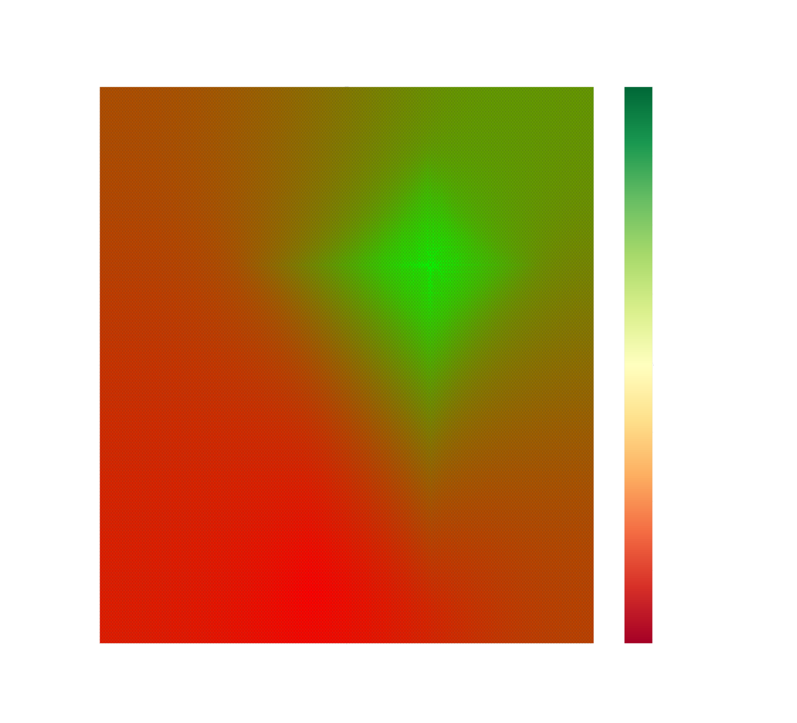

# RL-Learning

This repository contains my implementations from scratch of RL algorithms that
I have learned and experimented with. The goal is to understand the underlying
concepts and principles of RL by implementing them in code.

## Project Structure

```
RL-Learning/
├── README.md         # Project documentation
└── utils/            # Helper functions and utilities
```

### RL Notes
* [Q-Learning](#q-learning)
    * [Brief (Non-Comprehensive) Code Documentation](#brief-non-comprehensive-documentation-of-code)
* [Deep Q-Learning](#deep-q-learning)

## Getting Started

1. Clone the repository:
    ```bash
    git clone https://github.com/ohhh25/RL-Learning.git
    cd RL-Learning
    ```

2. Install dependencies:
    ```bash
    pip install -r requirements.txt
    ```

3. Run a simple Q-learning experiment:
    ```bash
    python Q-Learning.py
    ```



## Contributing

Contributions are welcome! Feel free to open issues or submit pull requests.

## License

This project is licensed under the [MIT License](LICENSE).

## RL Notes
Essentially trial and error learning, where the agent makes decisions and receives rewards based on the actions it takes. The agent's goal is to maximize the total reward it receives over time.

The agent makes decisions based on a policy function that tells the agent what action to take in a given state. In policy-based RL, the agent tries to learn the optimal policy directly. In value-based RL, the agent tries to learn the optimal value function. This value function is an estimate of the expected total reward the agent will receive from a given state.

Resources
* https://cs231n.stanford.edu/slides/2017/cs231n_2017_lecture14.pdf
* https://huggingface.co/learn/deep-rl-course

### Q-Learning
A Q-value function is a function that estimates the total reward the agent will receive from a given state-action pair. In Q-Learning, a QTable is used to store the Q-values for each state-action pair. This table is updated using the Bellman equation after each action the agent takes.

Limitations
* Not Practical for large state spaces and action spaces (including continuous spaces)
    * Becomes computationally expensive to store, update, and search through the QTable
* Not practical for environments where the agent only observes a partial view of the environment
    * The agent may not be able to learn the optimal policy from the partial view
    * This is because Q-Learning assumes the Markov property—the current state fully captures all relevant information for decision-making.
    * In practice, the agent may need to consider a history of states to make optimal decisions. Sensor data may be noisy, incomplete, have range limitations, etc. Hidden states may also exist that the agent cannot observe directly (e.g., the opponent's hand in poker).

### Deep Q-Learning


## Brief (Non-Comprehensive) Documentation of Code

### Q-Learning
Usage: `python Q-Learning.py`
There is a command-line argument to specify the environment to use. The default is `WORLD0` defined in `utils/GridWorld.py`. Same as `python Q-Learning.py --world=0`.
There is also `WORLD1` and `WORLD2`. A random world can be generated by specifying `--world=-1`. `WORLD3` illustrates a simple example of the limitations of Q-Learning, where the agent cannot learn the optimal policy due to the partial observability of the environment. Feel free to experiment with different environments and hyperparameters and to modify the code as needed to suit your needs. Examples can include generating your own custom worlds.
